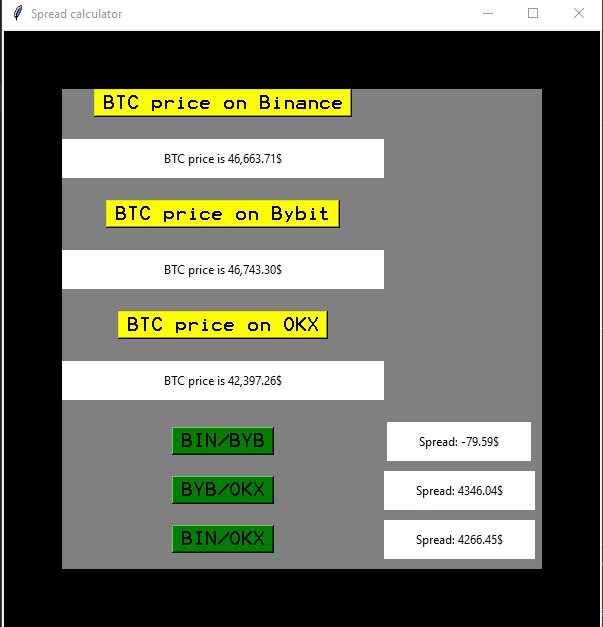

# Progrmmatūras apraksts
## Uzdevums

Kriptovalūta. Es sāku interesēties par to dažus gadus atpakaļ, un vienā brīdī es sapratu, ka varu automatizēt savu darbu ar Python valodas palīdzību.

Kad jebkura aktīva cena tirgū mainās, ne visās platformās tā mainās vienādi, tādēļ bieži vien var atrast iespēju kā var nopelnīt nopērkot kaut kādu aktīvu (piemēram Bitcoin) lētāk un pārdodot to dārgāk. Tas saucās ar gudriem vārdiem "Cryptocurrency Arbitrage". Bet dažreiz sēdēt un meklēt iespējas ir ļoti nogurdinoši manuāli ar rokām, tāpēc es izveidoju programmu, kas ar Selenium bibliotēkas palīdzību ceļos pa dažādām platformām un salīdzinās pēc tām Bitcoin cenas, ka arī rēķinās spread jeb starpību starp cenām, kas uzreiz dod iespēju noreaģēt laikā un nopelnīt.

## Bibliotēkas

Programmas izveidošanas ceļā tika izmanotas galvenokārt 2 bibliotēkas - Selenium, kas atļauj lasīt informāciju no tīmekļa un Tkinter, kas dod iespēju izveidot jau kaut ko līdzīgu neatkārīgai aplikācijai.

## Galvenās metodes

Darbs tika sadalīts ērtībai uz 2 failiem - uz backend(main.py) and frontend(window.py). Sākot ar main.py, pats galvenais šajā programmā ir Bitcoin cenas nolasīšana un izvadīšana. Šī darbība tika realizēta ar funkcijas get_crypto_price palīdzību, kas arī apstrādā kļūdas:

```Python
def get_crypto_price(url, accept_locator, price_locator, output_label): 
    driver = webdriver.Chrome() 

    try: 
        driver.get(url) 
        time.sleep(2)

        if accept_locator: 
            find_accept = driver.find_element(*accept_locator)
            find_accept.click()

        find_price = driver.find_element(*price_locator) 
        crypto_price_str = find_price.text.strip() 

        match = re.search(r'\d[\d.,]*', crypto_price_str) 
        numeric_price = match.group() if match else None 

        output_label.config(text=f"BTC price is {numeric_price}$") 

    except Exception as e:
        output_label.config(text=f"An error occurred: {e}") 

    finally:
        driver.quit() 
```

Un tālāk tika aprakstīta darbība ar Selenium bibliotēku:

```Python 
url_binance = "https://www.binance.com/en" 
accept_locator_binance = (By.ID, "onetrust-accept-btn-handler") 
price_locator_binance = (
    By.XPATH, "/html/body/div[3]/div/main/div[1]/div/div/div[2]/div[1]/div/div/a[1]/div[2]/div/div") 

url_bybit = "https://www.bybit.com/en"
price_locator_bybit = (
    By.CSS_SELECTOR, ".SectionList_price__3cLEn.SectionList_right__1nar7") 

url_okx = "https://www.okx.com"
accept_locator_okx = (By.ID, "onetrust-accept-btn-handler")
price_locator_okx = (By.CSS_SELECTOR, "a.ticker-item")

```

Tad mēs pārējam pie otra faila, kur no sākuma ir izveidots template darbam:

``` Python
window = Tk() 

window['bg'] = '#000000'
window.geometry('600x600') 
window.title('Spread calculator')

canvas = Canvas(window, height=600, width=600, background="black") 
canvas.pack()
```

Pēc tam tiek aprakstīta pogu darbība, kuras nolasa izvada BTC cenu, ar funckiju palīdzību:

```Python
def btn_binance_click(): 
    get_crypto_price(url_binance, accept_locator_binance, price_locator_binance, binance_label)


def btn_bybit_click():
    get_crypto_price(url_bybit, None, price_locator_bybit, bybit_label)


def btn_okx_click():
    get_crypto_price(url_okx, accept_locator_okx, price_locator_okx, okx_label)
```

Un šajā, manuprāt, grūtākajā daļa ir aprakstīta darbība vēl trim pogām, kuri paņem skaitlisko vērtību un rēķina spread starp cenām:

```Python
def btn_binance_bybit_click(): 
    try:
        binance_price_str = binance_label.cget("text") 
        bybit_price_str = bybit_label.cget("text") 

        binance_price = float(re.search(r'\d[\d.,]*', binance_price_str).group().replace(',', '')) 
        bybit_price = float(re.search(r'\d[\d.,]*', bybit_price_str).group().replace(',', '')) 

        spread = binance_price - bybit_price 

        spread_label_binance_bybit.config(text=f"Spread: {spread:.2f}$") 

    except Exception as e:
        spread_label_binance_bybit.config(text=f"An error occurred: {e}") 


def btn_bybit_okx_click():
    try:
        bybit_price = float(re.search(r'\d[\d.,]*', bybit_label.cget("text")).group().replace(',', ''))
        okx_price = float(re.search(r'\d[\d.,]*', okx_label.cget("text")).group().replace(',', ''))

        spread = bybit_price - okx_price

        spread_label_bybit_okx.config(text=f"Spread: {spread:.2f}$")

    except Exception as e:
        spread_label_bybit_okx.config(text=f"An error occurred: {e}")


def btn_binance_okx_click():
    try:
        binance_price = float(re.search(r'\d[\d.,]*', binance_label.cget("text")).group().replace(',', ''))
        okx_price = float(re.search(r'\d[\d.,]*', okx_label.cget("text")).group().replace(',', ''))

        spread = binance_price - okx_price

        spread_label_binance_okx.config(
            text=f"Spread: {spread:.2f}$")

    except Exception as e:
        spread_label_binance_okx.config(text=f"An error occurred: {e}")
```

Tad šeit tiek aprakstīts pelēks frame canvas iekšā:
```Python
frame = Frame(window, bg='grey')
frame.place(relx=0.1, rely=0.1, relheight=0.8, relwidth=0.8)
```

Un pēc tam arī tiek uzdotas vērtības, lai frame būtu proporcionāls:
```Python
frame.grid_rowconfigure(1, weight=1) 
frame.grid_rowconfigure(3, weight=1)
frame.grid_rowconfigure(5, weight=1)
```

Tagad paliek tīri vizuāla daļa, kur tiek aprakstītas pogas, labels(baltas vietas informācijas izvadei) un to izklājums:
```Python
btn_binance = Button(frame, text='BTC price on Binance',
                     bg='yellow', font='Terminal', command=btn_binance_click) 
btn_binance.grid(row=0, column=0, pady=(0, 10)) 

binance_label = Label(frame, text="", pady=10, padx=100, bg='white') 
binance_label.grid(row=1, column=0, pady=(0, 10))


btn_bybit = Button(frame, text='BTC price on Bybit', bg='yellow',
                   font='Terminal', command=btn_bybit_click)
btn_bybit.grid(row=2, column=0, pady=(0, 10))

bybit_label = Label(frame, text="", pady=10, padx=100, bg='white')
bybit_label.grid(row=3, column=0, pady=(0, 10))


btn_okx = Button(frame, text='BTC price on OKX', bg='yellow',
                 font='Terminal', command=btn_okx_click)
btn_okx.grid(row=4, column=0, pady=(0, 10))

okx_label = Label(frame, text="", pady=10, padx=100, bg='white')
okx_label.grid(row=5, column=0, pady=(0, 10))


btn_binance_bybit = Button(frame, text='BIN/BYB', bg='green', font='Terminal', command=btn_binance_bybit_click)
btn_binance_bybit.grid(row=7, column=0, pady=(0, 10))

spread_label_binance_bybit = Label(frame, text="", pady=10, padx=30, bg='white')
spread_label_binance_bybit.grid(row=7, column=1, pady=(0, 10))


btn_bybit_okx = Button(frame, text='BYB/OKX', bg='green', font='Terminal', command=btn_bybit_okx_click) 
btn_bybit_okx.grid(row=8, column=0, pady=(0, 10)) 

spread_label_bybit_okx = Label(frame, text="", pady=10, padx=30, bg='white') 
spread_label_bybit_okx.grid(row=8, column=1, pady=(0, 10)) 


btn_binance_okx = Button(frame, text='BIN/OKX', bg='green', font='Terminal', command=btn_binance_okx_click)
btn_binance_okx.grid(row=9, column=0, pady=(0, 10))

spread_label_binance_okx = Label(frame, text="", pady=10, padx=30, bg='white')
spread_label_binance_okx.grid(row=9, column=1, pady=(0, 10))

```

Un beigās paliek tikai pierakstīt mainloop komandu, lai to visu salīmēt kopā darbībai vienā logā:

```Python
window.mainloop()
```

Rezultātā programma pēc savu funkciju izpildīšanas izskatās tā:



P.S. Pašā programmas kodā var atrast detalizētus komentārus par katru no rindām.

## Noslēgums

Man bija patīkami izstrādāt šo projektu, jo kriptovalūtas tematika mani ļoti aizrauj un, manuprāt, man sanāca diezgan praktiska programma, kas patiešām padara manu dzīvi vieglāk.

Paldies par uzmanību!